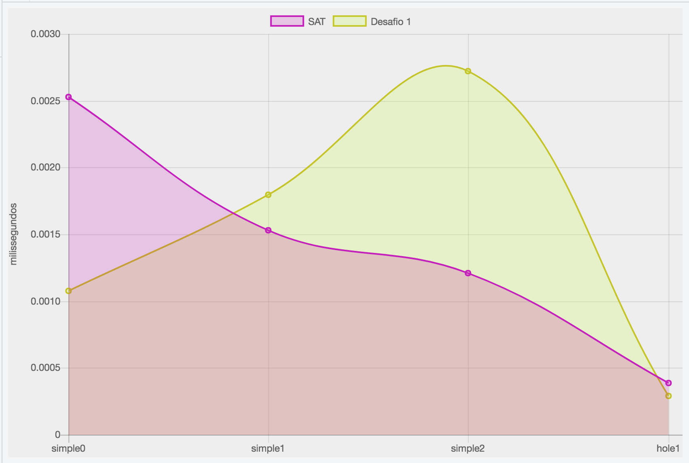

Um SAT solver (muito ruim)
========

Resultado dos testes. Medição em milissegundos:


A implementação do desafio1 mostrou-se mais lenta, em alguns momentos, que o brute-force. Talvez por causa da pobre implementação.

### Output do test.js ###
```
$ node test
cnf/simple0.cnf
	Sat [0.002527733ms]: [0,0,0,1]
	Des [0.001075607ms]: [0,0,0,1]
cnf/simple1.cnf
	Sat [0.001531711ms]: [1,0,0,0]
	Des [0.001798136ms]: [1,0,0,0]
cnf/simple2.cnf
	Sat [0.001209291ms]: null
	Des [0.002720954ms]: null
cnf/hole1.cnf
	Sat [0.000389534ms]: null
	Des [0.000288128ms]: null
cnf/hole4.cnf
RangeError: Maximum call stack size exceeded
```